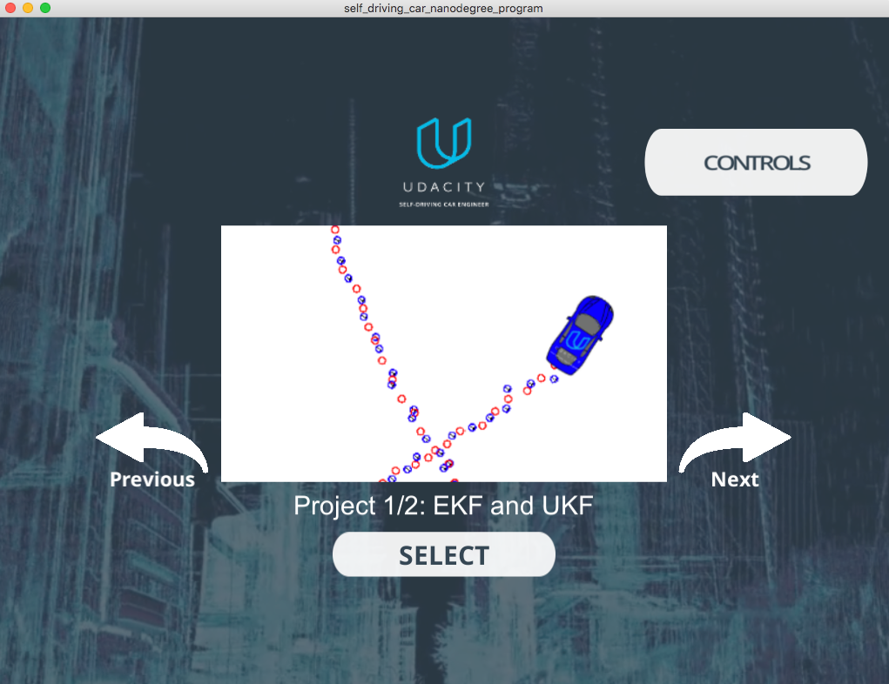
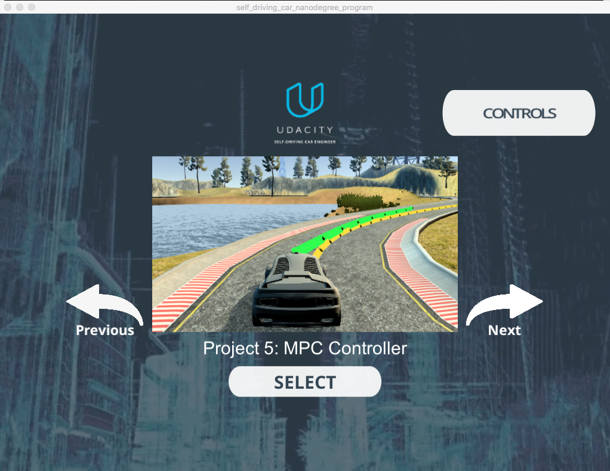

# CarND-MPC-Project-P5
Udacity Self-Driving Car Nanodegree - Model Predictive Control (MPC) Project

# Overview

This project implements a [Model Predictive Controller(MPC)](https://en.wikipedia.org/wiki/Model_predictive_control) to control a car in Udacity's simulator([it could be downloaded here](https://github.com/udacity/self-driving-car-sim/releases)). The simulator sends car telemetry information (the data specifications are [here](./DATA.md)) to the MPC using [WebSocket](https://en.wikipedia.org/wiki/WebSocket) and it receives the steering angle and throttle. The MPC uses the [uWebSockets](https://github.com/uNetworking/uWebSockets) WebSocket implementation to handle this communication. Udacity provides a seed project to start from on this project ([here](https://github.com/udacity/CarND-MPC-Project)).

# Prerequisites

The project has the following dependencies (from Udacity's seed project):

- cmake >= 3.5
- make >= 4.1
- gcc/g++ >= 5.4
- Udacity's simulator.

For instructions on how to install these components on different operating systems, please, visit [Udacity's seed project](https://github.com/udacity/CarND-MPC-Project). As this particular implementation was done on Mac OS, the rest of this documentation will be focused on Mac OS. I am sorry to be that restrictive.

In order to install the necessary libraries, use the [install-mac.sh](./install-mac.sh).

After that installation, there are two other required libraries:

- [Ipopt](https://projects.coin-or.org/Ipopt): To install this library we need to tap homebrew/science first:

```
> brew tap homebrew/science
```

Then install the package:

```
> brew install ipopt
```

- [CppAD](https://www.coin-or.org/CppAD/): `brew install cppad`

Note: It is possible you get this error message: `/usr/local/bin is not writable.` In order to fix that problem, follow the instruction suggested in this [link](https://stackoverflow.com/questions/26647412/homebrew-could-not-symlink-usr-local-bin-is-not-writable):

```
> sudo chown -R `whoami`:admin /usr/local/bin
> sudo chown -R `whoami`:admin /usr/local/share
> sudo chown -R `whoami`:admin /usr/local/lib
```

# Compiling and executing the project

In order to build the project there is a `./build.sh` script on the repo root. It will create the `./build` directory and compile de code. This is an example of the output of this script:

```
./build.sh
-- The C compiler identification is AppleClang 8.0.0.8000042
-- The CXX compiler identification is AppleClang 8.0.0.8000042
-- Check for working C compiler: /Library/Developer/CommandLineTools/usr/bin/cc
-- Check for working C compiler: /Library/Developer/CommandLineTools/usr/bin/cc -- works
-- Detecting C compiler ABI info
-- Detecting C compiler ABI info - done
-- Detecting C compile features
-- Detecting C compile features - done
-- Check for working CXX compiler: /Library/Developer/CommandLineTools/usr/bin/c++
-- Check for working CXX compiler: /Library/Developer/CommandLineTools/usr/bin/c++ -- works
-- Detecting CXX compiler ABI info
-- Detecting CXX compiler ABI info - done
-- Detecting CXX compile features
-- Detecting CXX compile features - done
-- Configuring done
-- Generating done
-- Build files have been written to: REPO_ROOT/CarND-MPC-Project-P5/build
Scanning dependencies of target mpc
[ 33%] Building CXX object CMakeFiles/mpc.dir/src/MPC.cpp.o
[ 66%] Building CXX object CMakeFiles/mpc.dir/src/main.cpp.o
[100%] Linking CXX executable mpc
[100%] Built target mpc
```

The project could be executed directly using `./build/mpc` or if there are some modification and a build is needed you can use the script `./makeAndrun.sh`:

```
> ./makeAndrun.sh
[100%] Built target mpc
Listening to port 4567
```

Now the MPC controller is running and listening on port 4567 for messages from the simulator. Next step is to open Udacity's simulator:



Using the left arrow, you need to go to the Project 5: MPC Controller:



Click the "Select" button, and the car starts driving. You will see the debugging information on the PID controller terminal. A short video with the final parameters is [./videos/final-parameters.mov](./videos/final-parameters.mov).

# [Rubic](https://review.udacity.com/#!/rubrics/896/view) points

## Compilation

### Your code should compile.

The code compiles without errors or warnings. No modifications were done on the provided setup.

## Implementation

### The Model

The model used is a Kinematic model neglecting the complex interactions between the tires and the road. The model equations are as follow:

```
x[t] = x[t-1] + v[t-1] * cos(psi[t-1]) * dt
y[t] = y[t-1] + v[t-1] * sin(psi[t-1]) * dt
psi[t] = psi[t-1] + v[t-1] / Lf * delta[t-1] * dt
v[t] = v[t-1] + a[t-1] * dt
cte[t] = f(x[t-1]) - y[t-1] + v[t-1] * sin(epsi[t-1]) * dt
epsi[t] = psi[t] - psides[t-1] + v[t-1] * delta[t-1] / Lf * dt
```

Where:

- `x, y` : Car's position.
- `psi` : Car's heading direction.
- `v` : Car's velocity.
- `cte` : Cross-track error.
- `epsi` : Orientation error.

Those values are considered the state of the model. In addition to that, `Lf` is the distance between the car of mass and the front wheels (this is provided by Udacity's seed project). The other two values are the model output:

- `a` : Car's acceleration (throttle).
- `delta` : Steering angle.

The objective is to find the acceleration (`a`) and the steering angle(`delta`) in the way it will minimize an objective function that is the combination of different factors:

- Square sum of `cte` and `epsi`. It could be found [here](./src/MPC.cpp#L55).
- Square sum of the difference actuators to penalize a lot of actuator's actions. It could be found [here](./src/MPC.cpp#L62).
- Square sum of the difference between two consecutive actuator values to penalize sharp changes. It could be found [here](./src/MPC.cpp#L69).

How much weight each of these factors had were tuned manually to obtain a successful track ride without leaving the road.

### Timestep Length and Elapsed Duration (N & dt)

The number of points(`N`) and the time interval(`dt`) define the prediction horizon. The number of points impacts the controller performance as well. I tried to keep the horizon around the same time the waypoints were on the simulator. With too many points the controller starts to run slower, and some times it went wild very easily. After trying with `N` from 10 to 20 and `dt` 100 to 500 milliseconds, I decided to leave them fixed to 10 and 100 milliseconds to have a better result tuning the other parameters.

### Polynomial Fitting and MPC Preprocessing

The waypoints provided by the simulator are transformed to the car coordinate system at [./src/main.cpp](./src/main.cpp#L104) from line 104 to line 113. Then a 3rd-degree polynomial is fitted to the transformed waypoints. These polynomial coefficients are used to calculate the `cte` and `epsi` later on. They are used by the solver as well to create a reference trajectory.

### Model Predictive Control with Latency

To handle actuator latency, the state value of the `cte` and `epsi` was calculated not at zero `x` but at `x * v * delay`. This gave me good results and made the latency independent from the `dt` of the controller. The code implementing that could be found at [./src/main.cpp](./src/main.cpp#L121) from line 121 to line 128.

## Simulation

### The vehicle must successfully drive a lap around the track.

The vehicle successfully drives a lap around the track. Here is a short video with the final parameters: [./videos/final-parameters.mov](./videos/final-parameters.mov).
